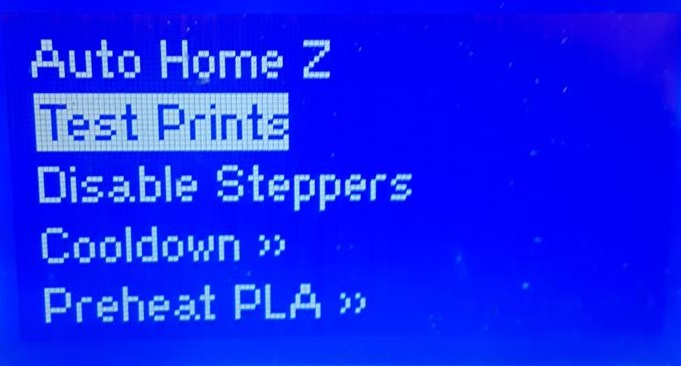
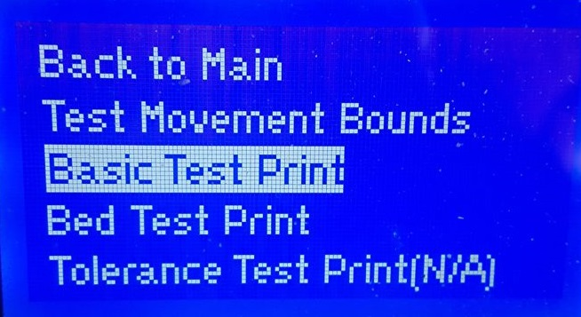
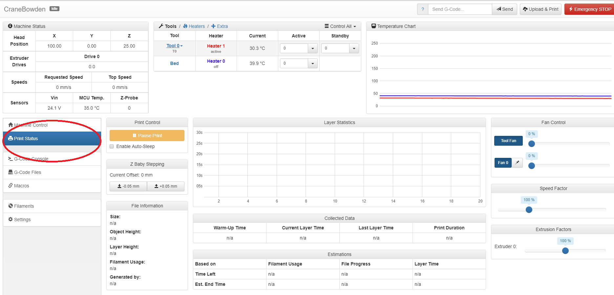

# First Print

Now that we've covered the very basics on the Duet Web Control Interface, and ran the Bed Leveling Assistant it's time to GET PRINTING. 

## Test Prints: print the test prints first

Before you start slicing and printing your own models it is highly recommended that you print the Test Prints that come pre-loaded for your M3D Crane Series printer. To ensure that your M3D Crane Series printer is operating exactly as intended, we've included several Test Prints that have been created in order to ensure optimal functionality. These test prints are already sliced and ready to go. You can access the Test Prints via the LCD screen Menu.  


It's recommended when setting up any printer for the first time to expect SOME experimentation in order to get to know your printer. This may consume filament in the process, so we advise you use a filament you are most comfortable with, however our test prints have been sliced using ABS-R. 


### To access the Test Prints:

* Select **Prepare**
* Move the knob to scroll through the Menu and Select **Test Prints**
* Select **Basic Test Print**

The Test Print will start running once selected. It may take several moments to start as the bed and the nozzle will need to get up to running temperature. Be sure to save detailed images of your Test Prints! 

## Uploading and Printing:

After you have printed the Test Prints it's time to start printing your own models! Here you will be shown how to upload and print via the Duet Web Control Interface. 

In the **upper right corner** of the Duet Web Control Interface click on the **Upload and Print** button. 

When you click on the **Upload and Print** button it will open a window that allows you to choose which gcode file you want to upload. The file will then be uploaded and the printing process will begin. 

The bed as well as the nozzle will begin to heat up according with the settings contained within the gcode file provided by your slicer, and once it's up to temp the print will start.  

## Print Status:

Near the **lower left corner** of the Duet Web Control Console there are tabs. Underneath the Machine Control tab will be **Printer Status**. 

Clicking on the Print Status tab will open a Print Control screen where you can monitor many aspects of your print as well as make changes in real time during the printing process. 


It's recommended that you do not make any changes without first doing further reading so as to not inadvertently cause damage to the print OR your M3D Crane Series Printer.   


Congratulations on your very first print with the M3D Crane Bowden printer! You can look forward to exceptional print quality and lasting reliability from your M3D Crane Series printer.  

Feel free to contribute to our ever expanding catalog of user submissions to share your knowledge and experience with the M3D Crane Bowden printer as we continue to grow together as a 3D printing community by following the[ Community Submissions and Attributions](https://crane.printm3d.com/community-submissions-attributions/community-submissions) section of this guide. Also don't forget to check out the Advanced Tuning for M3D Crane Series section of this guide for more information. 

