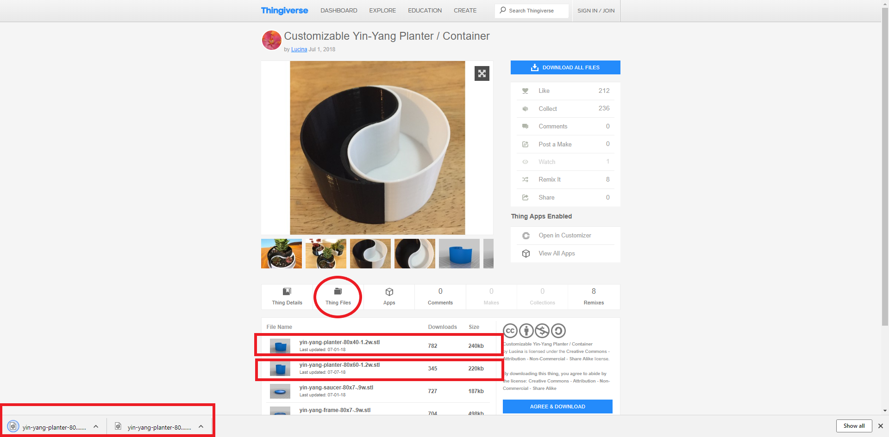

# Finding and Slicing a Model

## Slicing and Printing the first model: {#gmail-slicing-and-printing-the-first-model}

You may choose to create your own 3D models with software such as [Autodesk's Fusion 360](https://www.autodesk.com/products/fusion-360/overview), or[ Openscad](http://www.openscad.org/downloads.html), however you may wish to start printing models that are already available for download. You can find free models for 3D printing at [Thingiverse](https://www.thingiverse.com/), or you can try a few from [this list](https://all3dp.com/1/free-stl-files-3d-printer-models-3d-print-files-stl-download/).

Once you have found your ideal 3D model and downloaded it's **STL** file, it's time to download a **Slicer**. A **slicer** takes a 3D drawing \(most often in .STL format\) and translates this model into individual layers. It then generates the machine code \(g.code\) that the **printer** will use for **printing**.

While there are several great Slicers out there, both free as well as paid we recommend [Cura](https://ultimaker.com/en/products/ultimaker-cura-software). Download and install the latest version of **Cura by Ultimaker**. Cura will provide a wizard so that you can add your M3D Crane Series printer's dimensions and nozzle diameter

The M3D Crane Bowden has several Cura **Printing Profiles** that have been pre-configured, each to the optimal settings within Cura for a selection of different material types. You can find and download the first of those here within this point release:  [https://github.com/PrintM3D/Crane/releases/tag/1.1](https://github.com/PrintM3D/Crane/releases/tag/1.1) -- you can also find the latest version of the Bowden SD Card here in case you need it.

## Setting up your Slicer

Once you have downloaded your preferred slicer you can follow the steps below to see how to set up the slicer with the correct printer settings. For this example we'll be using Cura. 

### Cura

Open Cura's Setting by pressing **Preferences &gt; Configure Cura**_...._

Once you have opened Cura's settings we will go to **add a printer**. This is because we need to tell Cura the specifics of our printer, such as the maximum build volume of the printer. Press _**Printers**_ and then **Add** in order to add a new printer. This will open a new window.

Next, press **Custom**_._ This indicates we are adding a custom printer to Cura's loadout. You can define the **Printer Name** however you want. Then press **Add Printer**_,_ this should open another setting window_._

This window allows you to **configure the printer settings** of your M3D Crane Series printer. This informs Cura of the M3D Crane Series printer's build space, the firmware flavor and specifies starting and ending G-code. 

The **build volume** of the printer represents the **maximum value that the printer can travel in each directio**n.

 The **firmware flavor** is the type of firmware that the board is running. The Duet Maestro board runs on **RepRap firmware**. Your firmware flavor indicates what type of commands the board can understand. 

The **starting and ending G-code** is a series of commands that are run at the start and at the end of every print. This is important as it allows you to retract your filament after the print and turn all the heaters off. 

**Don't click** _**Close**_ **just yet!** Move on to the **Extruder 1** tab and fill in the following information. Fill in the **nozzle diameter and the material diameter**. Your nozzle diameter may vary in the future as you mount different types of nozzles on your M3D Crane Series Printer. Then you can click **Close.**

Once you have added the printer make sure to activate it by selecting the name and then clicking the button **Activate**_._

### Importing the Printer Profile {#importing-the-printer-profile}

In Cura, open the Preferences again by clicking _Preferences &gt; Configure Cura._ Click _Profiles &gt; Import_. Then a window will pop up that will allow you to navigate to the profile you just downloaded. It will most likely be in the _Downloads_ folder.

Once you have properly imported the file you will have to _****_**Activate** it. Select the profile and click the button **Activate**_._ The print settings you just downloaded have now been applied to Cura. Whenever you slice a model, it will now incorporate these settings.

## Slicing your Model

Slicing your model is an extremely important step. Most slicer software allow you to control different print settings such as layer height or print speed in order to change how you print. Slicing has great effect on the quality of your print you produce. For additional information on Cura settings please go [here](https://ultimaker.com/en/products/ultimaker-cura-software).

Now that your settings are optimized with the imported printer profile, you can slice your model. Simply click the "**prepare to print**" button in the lower right corner of the slicer to generate your g.code. **Save this new file to your computer.** 

Your model is now saved on your hard drive. Just follow the instructions for how to use your[ Duet Web Control Interface](https://crane.printm3d.com/crane-bowden-guide/intro-to-duet-web-control), to learn how to upload your new gcode file. Enjoy watching your models come to life! 

