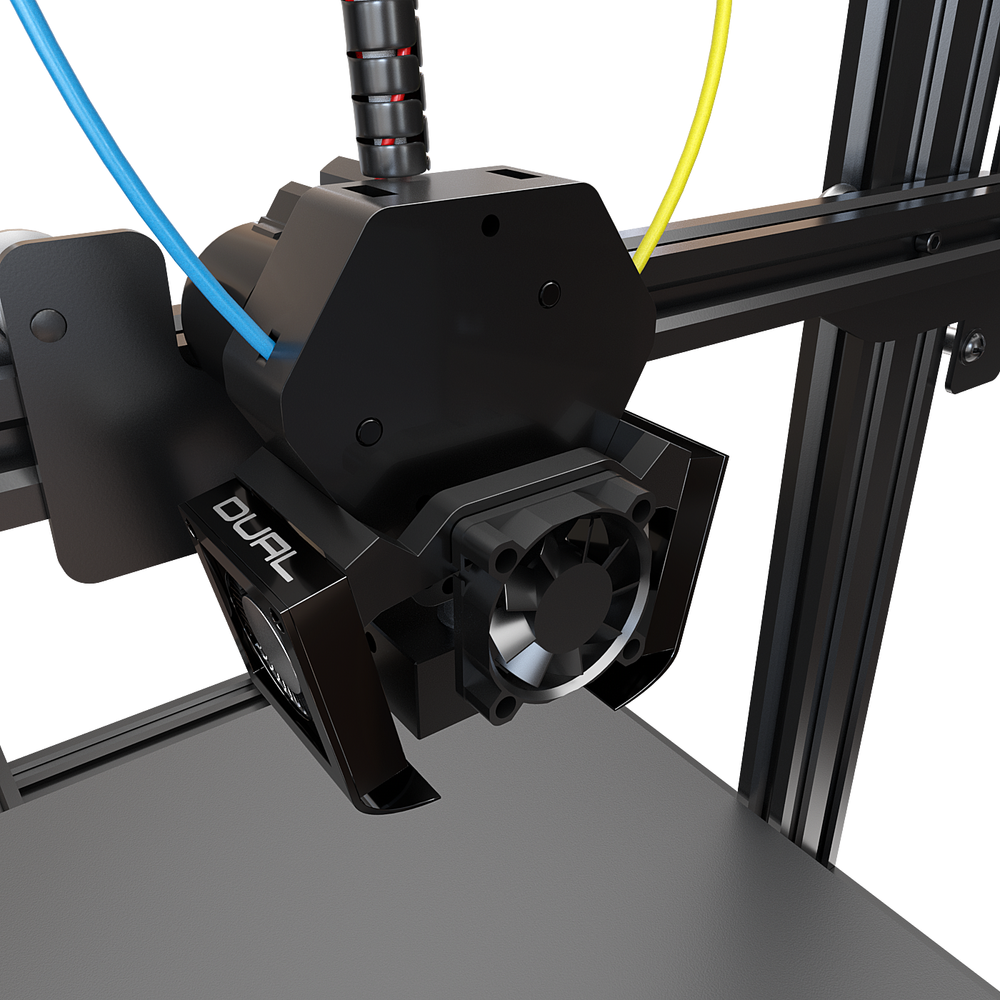

# Loading and Unloading Filament

## **Loading and unloading Filament:**


Warning before loading:

Verify that wiring between the Duet 2 Maestro and the M3D Crane \(including wiring to the QuadFusion and other printer components\) is correct.Verify that the Duet 2 Maestro firmware is updated to the most recent version. You can find version 2.O2 release candidate [here](https://github.com/dc42/RepRapFirmware/releases/download/2.02RC2/DuetMaestroFirmware.bin).In addition you can find the latest version of Duet Web Control [here](https://github.com/dc42/RepRapFirmware/releases/download/2.02RC2/DuetWebControl-1.22.3.zip).Be sure to double check that the cold section fan 1 is running at full power. \(This is needed for long term heatbreak cooling\)


## Pre-loading Process

* Start by cutting your filament flush. You should start with 4 new strands. **\(poorly cut filament may damage PTFE or bind up in the curved path\)**
* Observe port labeling 0-3 and select extruder drive 0 \(If unlabeled, they are in left to right order and the left most will be extruder drive 0\)
* Select a feed rate of 5 mm/s \(any faster and it may shred the filament or cause the motor to skip\)
* Select a 20 mm filament feed amount


**Be sure to set the temperature to 170C** **Not doing this will cause backflow up the nozzles chambers that will block future loadings!**


## **Loading Sequence** 

1. Insert your chosen filament in to Port 0 and hold it at a curved angle. \(Use the natural curve of the filament to match the curves shown below to minimize any risk of missing the curve path\)

   

2. Press retract while pushing filament lightly in, this is to verify that things are working and that you're in the right position and chose the right port. If the filament is ticking in your hands, go ahead and press the filament towards the gear while pushing the extrude button. \(You should to feel the filament grab and pull through.\)
3. Lightly hold the filament in your hands and press extrude again until filament stops extruding. Repeat once mote times for a total of 60 mm fed through.
4. If at any point filament gets stuck proceed to troubleshooting \(Retract and try again. TBD\)
5. Repeat the above procedure for extruder drive 2 and THEN with ports 1 and 3.

## Extrusion: 

* Set the temp to 240C \(nozzle may ooze ignore it\)
* Change settings to extrude all at 15mm/s and leave the extrude amount at 20mm.
* Confirm your temperature is still set to 240C.
* Hit extrude \(Waiting between steps\) until filament comes out at a steady speed.
* Be sure that no motors are skipping \(if they are see our troubleshooting section TBD\)

## Unloading: 

* Set Nozzle Temperature to 170C.
* Change setting to Extrude All, Extrude at 15mm/s and set the extrusion amount at 100mm
* Press retract 3 times
* The machine may now be turned off


There are no special considerations for turning off your M3D Crane Dual. However, keep in mind that filament should not be above temperature without motion for longer than 5 minutes, with the exception of PETG; which can handle being held at temperature in the M3D Crane Dual for at least one day. PLA readily degrades.


