# Unboxing and Assembly


The M3D Crane Dual contains sensitive electronics, delicate mechanical parts, and an electrical heating system. Please exercise all applicable safety precautions and follow this guide closely to avoid damage to your M3D Crane Dual, to avoid injury to yourself or others, and insure proper operation.

Check your Local Supply Voltage and set your printers Voltage accordingly, or risk damage to your printer.


## Setting up after unboxing your printer:  

After removing your M3D Crane Dual from the box, remove all the plastic wrapping being careful not to cut any of the sensitive parts of the device, such as the cables. Your M3D Crane Dual should look like this:

Remove the bolts at the bottom of each upright rail, as shown below. Setting them aside briefly:


Inspect your M3D Crane Dual for any damage that may have occurred during shipping. Every precaution has been made to prevent this, however it is advisable to give all the components a thorough inspection before operation. If any issues are discovered, document the damage by taking an image of the affected area and contact M3D immediately.


As long as no issues are discovered, you are ready for mechanical assembly.

## Assembly:  

Being careful not to stress or pull any of the cables, have a friend assist you in raising the upright rails; be sure to **align the bolt holes**.

If you aren't able to hold the upright in place, get someone's help to steady it. Line up the bolt holes \(that previously housed the bolts you removed\) and begin slowly tightening the bolts; first hand tighten, then slowly tighten more firmly with the provided **Allen Key**.

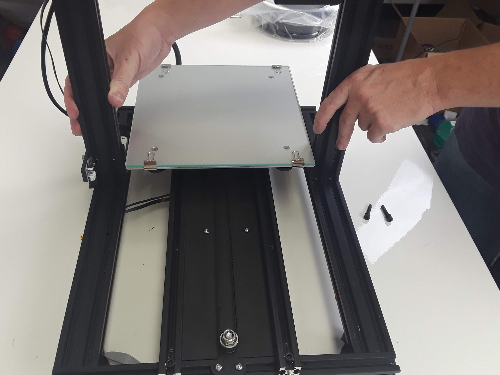

Ensure that all motor cables are connected. These are part of the **black ribbon cable**. You can identify the correct motor cable by looking at the **yellow tags reading 'X, Y, and Z'.** The motor connections are made up of 4 wires, while the associated endstop cable is a three wire cable directly beside the 4-wire cable for the respective motor; the only motor without an endstop is the extruder.

Connect the two gray ribbon cables labeled '1' and '2' and connect them to their respective ports on the back of the LCD assembly, 'EXP1' and 'EXP2'. **Be careful not to cross these connections as it may damage the LCD Screen.**

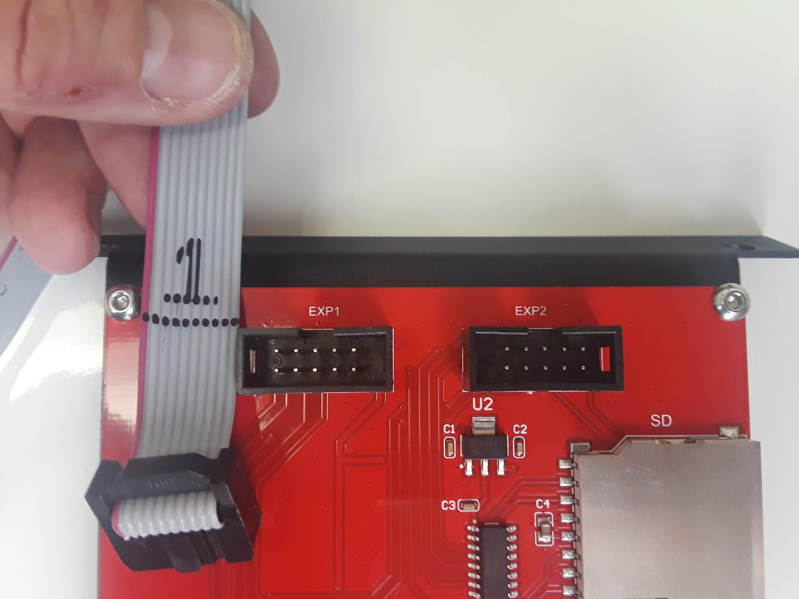

Should you find that your LCD cables are not labeled, simply determine which cable is **shortest**, that will be the cable to be connected to **EXP1**.

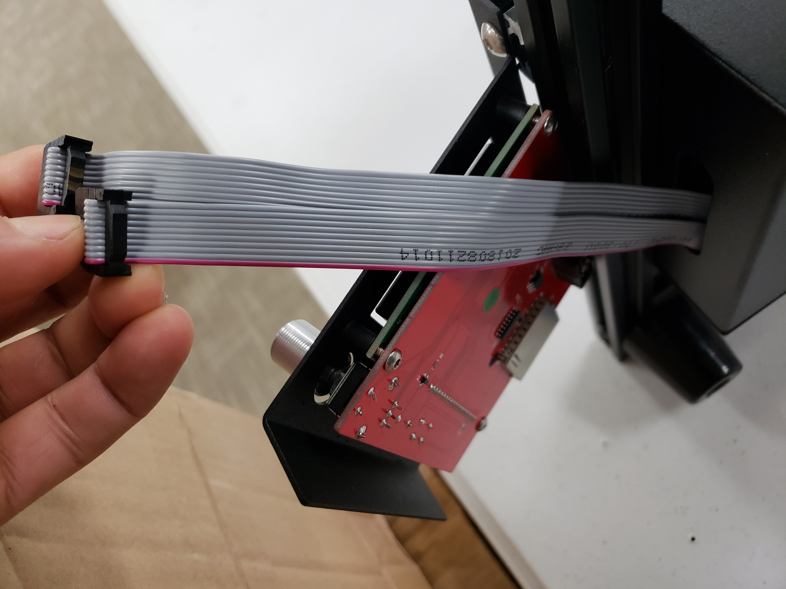

Connect the **short cable to EXP1**, plug the **longer** **cable into EXP2**, and proceed to the next step.

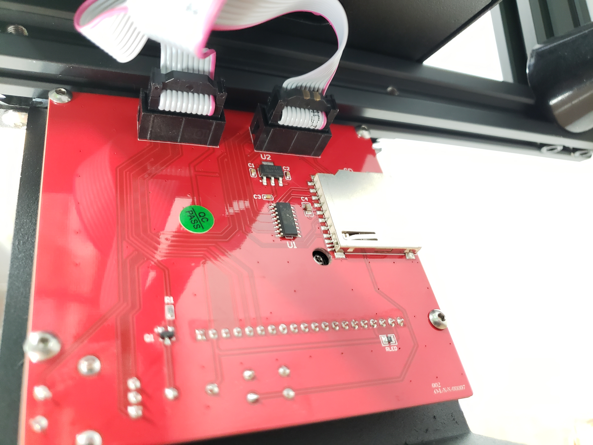

After making the connections, use the provided bolts and Allen Key to secure the LCD to the front of the M3D Crane Dual.

## Z-endstop positioning:

Be sure your M3D Crane is powered off and/or unplugged before you begin this step.

In order to ensure nothing is damaged during shipping, and furthermore during the first power on of your M3D Crane, it's been shipped with the Z-endstop raised. You will need to manually lower your Z-endstop before printing.

The first step to moving your Z-endstop to an appropriate height is to examine the exposed bolts below the Y-carriage and to tighten/loosen all four of your bed nuts so that only about 8-10 threads are exposed on each. You can see in this photograph a bolt that has been tightened to its recommended position. Use your own 7mm or 1/4th inch wrench to ensure each bolt is adjusted to approximately the same position.

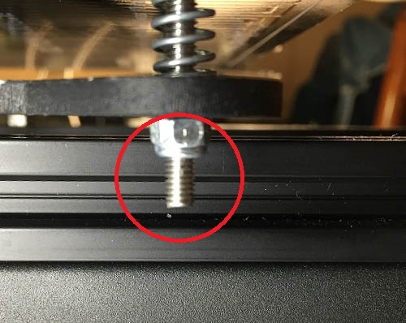

Next you will need to manually center the print head over the bed. To do this gently move the print head left-to-right along the X-axis until it's in the center. Then, move the bed forward along the Y-axis until its center. At this point, the print head should be above the center of the bed. Finally, rotate the coupler between the Z-motor and the Z-leadscrew counter-clockwise until the left bracket of the X-axis is resting on top of the Z-endstop switch as seen in the photo.

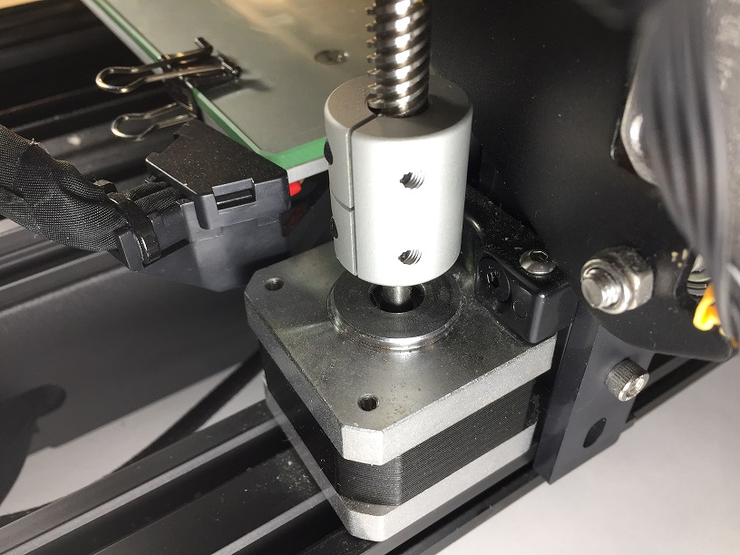

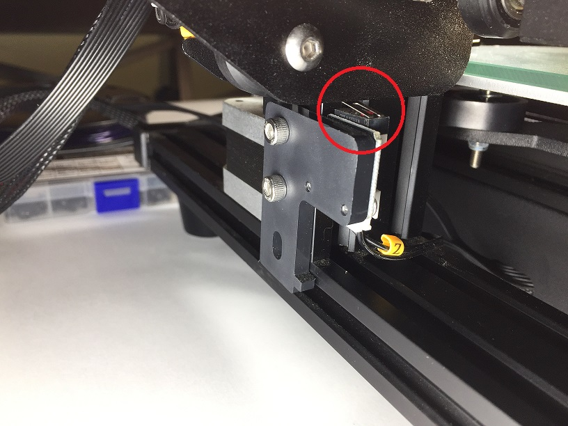

The Z endstop is attached to the rail with two T-nuts that hang the inside of the aluminum extrusion channel. Loosen the Z endstop bracket enough to loosen the 2 screws that secure the bracket to the rail.

After loosening the Z-endstop and allowing it to move down, we are now free to move the printhead closer to the bed. Slowly lower the print head until the nozzle touches the bed.

Little by little raise the Z endstop until a click is heard/felt and then tighten down the 2 screws again. You should be able to secure one of the nuts fairly easily to maintain the position of the Z endstop.

Manually raise your print head by rotating the Z axis and now you are ready to power on the M3D Crane and select Home All in the LCD menu. While it is still necessary that we run through the leveling process with the printer powered on, making these changes ensures that we do not cause any damage to the print surface.

In order to assure your M3D Crane Series printer maintains an accurate bed level after following the [Bed Leveling](https://crane.printm3d.com/~/edit/drafts/-LTi556ASBKSVfOwPujM/crane-bowden-guide/manual-bed-leveling) section of this guide it may be necessary to make further adjustments to the Z endstop position. Maneuvering the Z endstop in conjunction with following the Bed Leveling guide will lead to a more accurate and level print bed.

## X Bracket Alignment and tightening:

Should you notice your x bracket, the plate attaching the print head to the x axis is loose OR too tight follow the instructions in the pro-tuning guide to learn how to loosen or tighten the eccentric nuts that secure the x bracket to it's axis.

[https://crane.printm3d.com/advanced-tuning-m3d-crane-series/tuning-guide](https://crane.printm3d.com/advanced-tuning-m3d-crane-series/tuning-guide)

Should your x bracket appear warped or bent, please be sure to check that the eccentric nuts are not too tight. It should be secure enough so that then print head doesn't move around during printing about 1/16-1/12th turn extra past this point on the eccentric nuts should be sufficient any tighter could result in the appearance of warping or bending of the x bracket. Loosing these eccentric nuts should remedy this.

## Rubber Feet:

If your Crane is shipped without the feet assembled, please follow this videio instruction guide



## Crane Spool Holder:

This new Spool Holder design is much more simple. It's a **SINGLE** small spool holder, which is meant to slip into the back facing groove in the top rail of your M3D Crane Series printer. You can print just one, however we do recommend you print up to 4. Having the Spool Holders as singles allows for more mobility, you can now move each spool holder along the axis so as to help control the filament's path to the Dual print head.

### Spool Holder 2.1

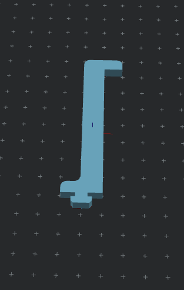

There is the original Spool Holder design meant to hold up to 4 Micro Spools.

### Spool Holder 1.0

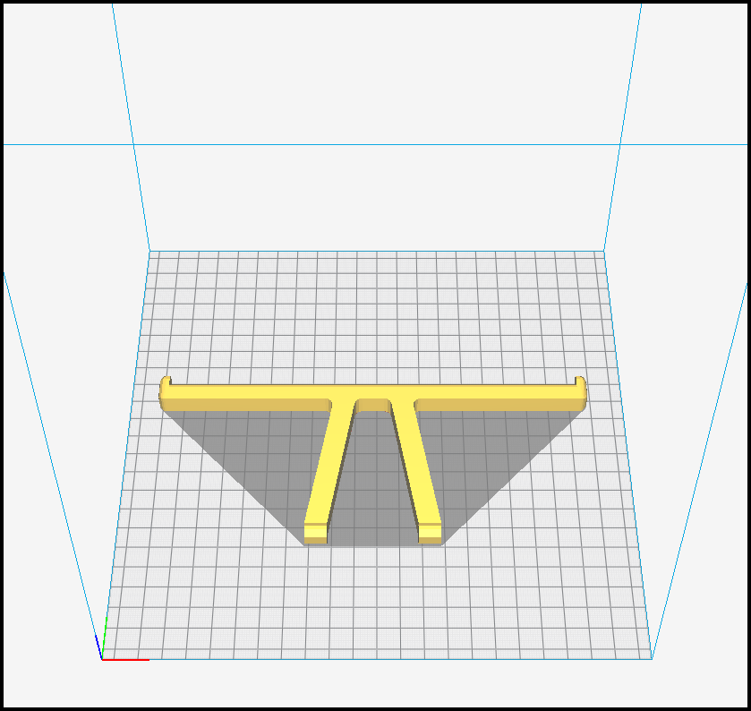

### **Additional Information:**

**It is not necessary to print the Spool Holder using CMYK filament**, in fact it's recommended you use the spool holder as one of your first "test prints". This will allow you to accurately calibrate your machine, make sure it's level and is printing properly using a filament you are most comfortable with such as a generic PLA for example.

You can also download [both Crane Spool Holder STL files](https://coda.io/d/M3D-Official-Troubleshooting-Self-Help-Guide_dzE73kMbIAL/All-Printable-STL-Files_sugSV#_lusb9).


As stated above, the first few M3D Crane printers did come with a 3D printed spool holder, which was designed to hold all 4 of the smaller CMYK filament spools. This design has been upgraded but the 3D printed spool holder is **NO LONGER** included in the box with the printer. We **DO** have the **STL file** for the updated spool holder design. We suggest you download the STL, slice it, and print it to your own specifications.


## Endstop Damage:


Occasionally things can be damaged during shipping, and or come loose. If you notice that one of your end-stops has broken, you can swap any of the others to replace the Z end-stop as this one is the most important.


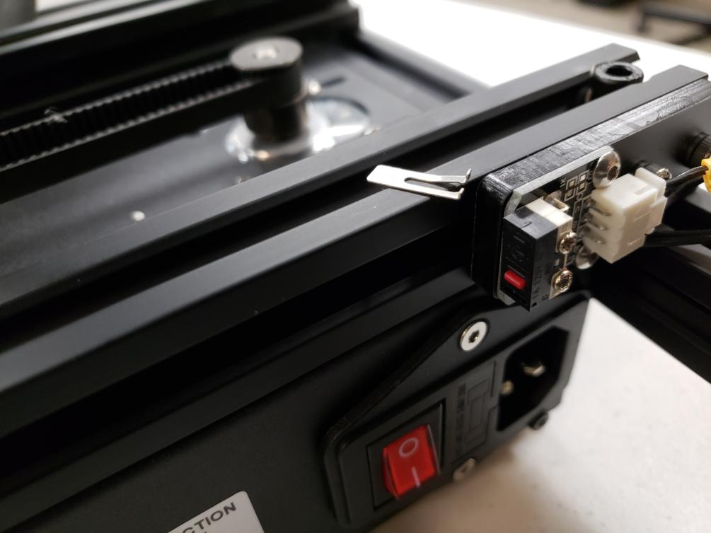

## Before powering on your M3D Crane Series Printer:

You should have received along with your printer, a micro SD card as well as a blue micro SD card adapter. Check the SD card slot on the right side of your Crane Series printer to see if yours was shipped with the SD card already in place. If your SD card is already in place, remove it and replace it before powering it on. The SD card may have been shifted or impacted during shipping and turning on the power with the SD card askew inside could lead to damage.

If your SD card has arrived in a small separate case, simply remove the SD card from it's package and place it into the SD card slot on the right side of your Crane Series printer.

The Crane Series of printers are unique in that they are built with a Duet Maestro board. The Duet board uses the information on the SD card to operate, in a sense the SD card that goes in the slot on the Duet acts like it's hard drive. It is for this reason that should you desire to use an SD card to move your gcode to your printer instead of using Duet Web Control, it's recommended to purchase a second micro SD card and use the SD card slot on the back of the LCD screen.

## Additional information:

After assembly you may have some questions that might be further discussed in our[ Pro Tuning Guide](https://crane.printm3d.com/advanced-tuning-m3d-crane-series/tuning-guide).


Prior to exiting this section, please double check all connections, and place your M3D Crane Dual on a flat surface. Ensure the Power Switch is Off\(O\), double check that your voltage is set appropriately for YOUR area\(consult local authorities if you are unsure\). **Failure to do this can irreparably harm the electronics in your printer.**


Once your M3D Crane Dual is complete it should look like this:

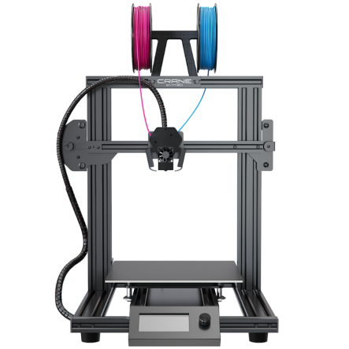

Congratulations!! You have assembled your new M3D Crane Dual printer!! Move on to the next section to learn how to add the M3D Crane Dual to your existing network or setup a network from scratch.

