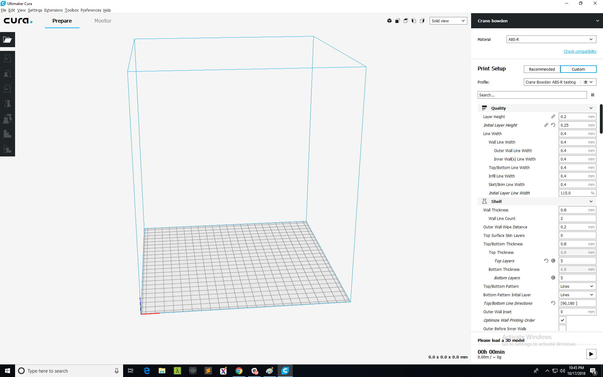

# Finding and Slicing a Model

## Slicing and Printing the first model: 

You may choose to create your own 3D models with software such as [Autodesk's Fusion 360](https://www.autodesk.com/products/fusion-360/overview), or[ Openscad](http://www.openscad.org/downloads.html), however you may wish to start printing models that are already available for download. You can find free models for 3D printing at [Thingiverse](https://www.thingiverse.com/), or you can try a few from [this list](https://all3dp.com/1/free-stl-files-3d-printer-models-3d-print-files-stl-download/).

Once you have found your ideal 3D model and downloaded it's **STL** file, it's time to download a **Slicer**. A **slicer** takes a 3D drawing \(most often in .STL format\) and translates this model into individual layers. It then generates the machine code \(g.code\) that the **printer** will use for **printing**.

While there are several great Slicers out there, both free as well as paid we recommend [Cura](https://ultimaker.com/en/products/ultimaker-cura-software). Download and install the latest version of **Cura by Ultimaker**. Cura will provide a wizard so that you can add your M3D Crane Series printer's dimensions and nozzle diameter

The M3D Crane Bowden has several Cura **Printing Profiles** that have been pre-configured, each to the optimal settings within Cura for a selection of different material types. You can find and download the first of those here within this point release:  [https://github.com/PrintM3D/Crane/releases/tag/1.1](https://github.com/PrintM3D/Crane/releases/tag/1.1) -- you can also find the latest version of the Bowden SD Card here in case you need it.

Once you have selected and downloaded the Cura Printing Profile you will need for the material you are printing in, you can **Import the profile into Cura and Save it.** You can find these options in the Menu Bar at the top of the slicer's window. For additional information on Cura settings please go [here](https://ultimaker.com/en/products/ultimaker-cura-software).

Now that your settings are optimized with the imported printer profile, you can slice your model. Simply click the "**prepare to print**" button in the lower right corner of the slicer to generate your g.code. **Save this new file to your computer.** 

Your model is now saved on your hard drive. Just follow the instructions for how to use your [Duet Web Control Interface](https://crane.printm3d.com/~/drafts/-LMGnnAn5_tvVgYh8GkJ/primary/v/master/duet-web-interface-new), to learn how to upload your new STL file. Enjoy watching your models come to life! 

## **Color Printing for the M3D Crane QuadFusion:**

The M3D Crane QuadFusion is unique among consumer FDM printers in that it’s able to mix and produce a huge range of color. In order to take full advantage of your M3D Crane QuadFusion’s stunning color range you’ll need to prepare your model for color printing.  

There are a few full color models available online already and you may wish to start out or experiment with those at first. Full color models will already be broken up into several different STL files, all of which will assemble when uploaded into your slicer.  

If you already have a model in mind, but it's not already separated or prepared for color printing you will need to do so yourself using MeshMixer or Blender. You will need to select and separate the different sections of your model into separate facegroups, or shells and save them all separately. 

Depending on your slicers capabilities, you may be able to assign color to each separate part of your assembled model. You may need to utilize a tool such as MeshMixer or Blender however to assign colors or texture maps to your model.Within your slicer you will then assign an extruder to each of the color sections of your model. Depending on the slicer, you may be able to assign a color to each extruder. This could be the natural color of the filament or in some slicers you'll be able to assign a mixed color. Once you are happy with the colors you have assigned to each extruder, you will need to color your model. Simply make sure you assign the extruder with the color you want, to the section of the model that corresponds.  

## **Voxelizer: A most capable color mixing slicer**

As we pioneer color mixing technology, we rely on other services and software to rise to the challenge and innovate along side us. One of the more reliable and easiest to use slicer for color mixing out there is Voxelizer. They offer a free trial period as well as very reasonable subscription fees. Voxelizer is by far the best slicer for the job of color mixing there is currently. We recommend downloading Voxelizer and experimenting with the slicer to experience it for yourself. 



When you download and set up your Voxelizer account you will see that our M3D Crane Series printers already have a printer profile. 

You can choose from each of the three Crane Series models, and those profiles will automatically contain the standard settings for each of the Crane Series printers, so you will not have to go through each setting setting manually. From these preset printer profiles you'll be able to explore the slicer on your own by adjusting or customizing the presets, adding and assigning color to your model, and even creating custom color blends, and filament profiles. 

Voxelizer is an extremely powerful tool. The information covered here hardly scratches the surface of what all you can accomplish with it. As our user base grows, and more and more start to utilize this powerful new color printing tool we'll all gain by a sharing of information, the swapping of tips and tricks as well as more basic tutorials. 

We have some User Submitted videos on Voxelizer here:





**Please return soon for more in depth and up to date information as we ready more tools to enable your M3D Crane Quad-fusion to realize it’s full color mixing potential.**    

Now that we've covered the basics of finding, coloring, and slicing your 3D models, you are ready to make your first print using the M3D Crane Quad printer! The next section will guide you through your first print!    

