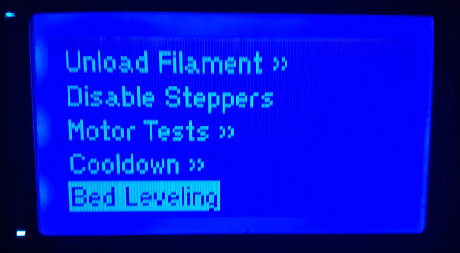
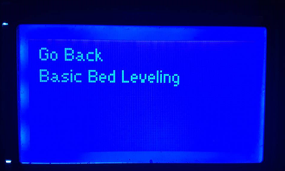
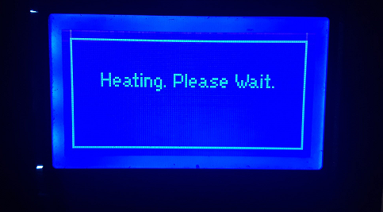
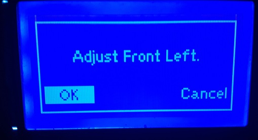
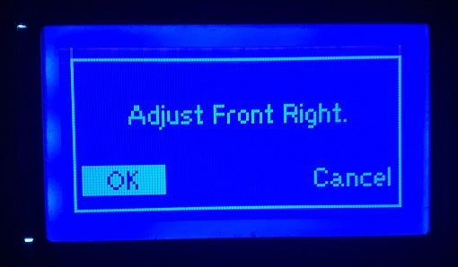
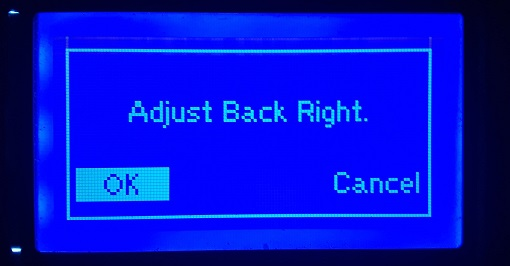
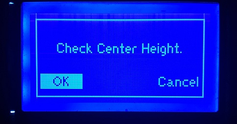

# Bed Leveling

## **Leveling your M3D Crane Series printer via the LCD menu:**  

### **Before you begin:** 

Your bed may have settled while shipping, so before you level your print bed we recommend using the following process to equalize the tension on the springs as well as freeing any that may be compressed**.**

Grasp each side of the print bed with each hand, palms resting on your print bed surface and your fingers resting on the underside of the bed’s carriage. Simply depress the print bed several times to allow the springs to equalize.

## **Basic Bed Leveling:**  


**For optimal Bed Leveling be sure to use this Bed Leveling guide in conjunction with the adjustments made to your Z endstop position in the Unboxing/Assembly section of this guide. Maintaining proper Z endstop positioning as well as following proper Bed Leveling procedures will ensure the most accurately leveled print bed, thus producing higher quality prints.**   


Scroll through the LCD main menu and select **Prepare** scroll down select **Bed Leveling**. In the sub menu select **Basic Leveling.**

In order to complete the Basic Leveling process you will need **a piece of paper** or an index card of regular 8.5 x 11 paper thickness.


**IMPORTANT:** **As you begin the Basic Leveling process, there will be only 2 options after each prompt; OK or Cancel. You may not go back, so if you are unsure about any step simply select Exit and begin the process from the beginning.**


 Once Basic Leveling is selected, your M3D Crane Series printer will **Home All**.  After homing, the print head will lift 50mm, and the bed as well as the nozzle will start to heat to temp.

When your M3D Crane Series printer is finished homing, the print head has moved up 50mm, and both the bed and the nozzle have come up to temp, the next prompt on the Basic Leveling menu will appear: **Clear Nozzle Of Excess Filament.** After clearing the nozzle of any excess filament, select **OK** to be given the next prompt in the Basic Leveling process.


**WARNING: At this point the bed and the nozzle will be up to temp, be sure you take necessary precautions to avoid burns.**


 The print head will move to the **Left Front** corner and prompt you to **Adjust the Left Front Bed Nut.**

Place your paper under the print head and adjust the Left Front Bed Nut until you feel a **slight resistance** when you try to move the paper. You should still be able to move the paper, sliding it from front to back while experiencing some resistance from the print nozzle. Use the wrench provided with your M3D Crane Series printer to **adjust the Left Front Bed Nut** accordingly and select **OK** when ready to move on.


**NOTE: If you can move the paper too easily and it’s experiencing no resistance then your nozzle is still too far from the build plate, and if you can’t move your paper at all or are experiencing severe resistance then your nozzle is too close to the build plate.**


 The print head will then move on to the next point and the LCD will display the next prompt: **Adjust Right Front Bed Nut**. Repeat the process of using the paper to help you adjust the Right Front Bed Nut and select **OK** when finished.

The Basic Bed Leveling sequence will repeat the same prompts for the **Right Rear Bed Nut** and the **Left Rear Bed Nut**. Again, once you are satisfied with these adjustments select **OK** to be given the last prompt in the sequence.

**Check Center Bed Height**, is the last prompt in the Basic Bed Leveling Sequence. When checking the Center Bed Height be advised that at the center the paper should experience **slightly more resistance** than the other points. Once you have checked your Center Bed Height, select **OK** to finish the Basic Bed Leveling Sequence. You may wish to run the sequence several times to fine tune your results.


**NOTE: If the paper has little or no resistance, or is so tight it threatens to tear rather than be moved, repeat the Basic Bed Leveling process over again until the desired results are achieved.**


Congratulations on leveling the print bed of your M3D Crane Quad printer!! In the next section we will go over how to use the controls to head the print bed and nozzle. Learning the basics of operating your M3D Crane Quad printer are very important, follow the guide to the next section to get started.   

