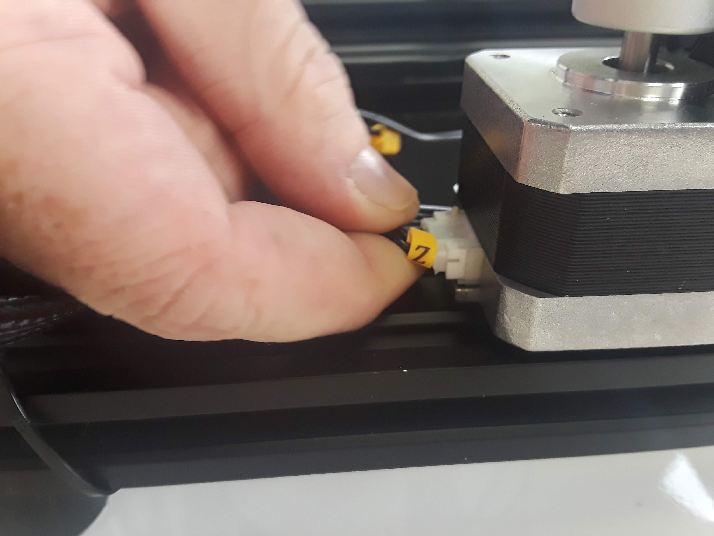
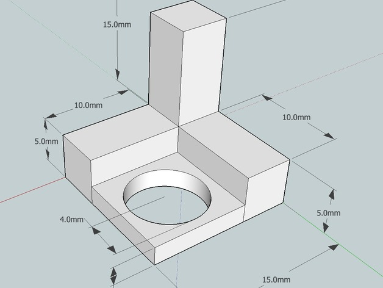

# M3D Crane Quad Quick Start Guide \(new\)


The M3D Crane Quad contains sensitive electronics, delicate mechanical parts, and an electrical heating system. Please exercise all applicable safety precautions and follow this guide closely to avoid damage to your M3D Crane Quad, to avoid injury to yourself or others, and insure proper operation.


## Setting up after unboxing your printer: {#gmail-setting-up-after-un-boxing-your-printer}

After removing your M3D Crane Quad from the box, remove all the plastic wrapping being careful not to cut any of the sensitive parts of the device, such as the cables. Your M3D Crane Quad should look like this:

Remove the bolts at the bottom of each upright rail, as shown below. Setting them aside briefly:


Inspect your M3D Crane Quad for any damage that may have occurred during shipping. Every precaution has been made to prevent this, however it is advisable to give all the components a thorough inspection before operation. If any issues are discovered, document the damage by taking an image of the affected area and contact M3D immediately.


 As long as no issues are discovered, you are ready for mechanical assembly. 

## Assembly: {#gmail-assembly}

Being careful not to stress or pull any of the cables, have a friend assist you in raising the upright rails; be sure to **align the bolt holes**.

If you aren't able to hold the upright in place, get someone's help to steady it. Line up the bolt holes \(that previously housed the bolts you removed\) and begin slowly tightening the bolts; first hand tighten, then slowly tighten more firmly with the provided **Allen Key**.

Ensure that all motor cables are connected. These are part of the **black ribbon cable**. You can identify the correct motor cable by looking at the **yellow tags reading 'X, Y, and Z'.** The motor connections are made up of 4 wires, while the associated endstop cable is a three wire cable directly beside the 4-wire cable for the respective motor; the only motor without an endstop is the extruder.

Connect the two gray ribbon cables labeled '1' and '2' and connect them to their respective ports on the back of the LCD assembly, 'EXP1' and 'EXP2'. **Be careful not to cross these connections as it may damage the LCD Screen.**

After making the connections, use the provided bolts and Allen Key to secure the LCD to the front of the M3D Crane Quad.


Prior to exiting this section, please double check all connections, and place your  M3D Crane Quad on a flat surface. Ensure the Power Switch is Off\(O\), double check that your voltage is set appropriately for YOUR area\(consult local authorities if you are unsure\). **Failure to do this can irreparably harm the electronics in your printer.**


Once your M3D Crane Quad is complete it should look like this:

## First steps with your M3D Crane Quad: {#gmail-first-steps-with-your-m-3-d-crane-bowden}

Once your M3D Crane Quad is assembled and powered on, follow these steps to printing your first test print. The M3D Crane Quad comes with a [**test print pre-loaded on it's SD card**](https://www.thingiverse.com/thing:170922/files). This print is very important as it will be used to make sure your M3D Crane Quad is calibrated correctly.

The very first step is to **Home** your M3D Crane Quad. To do this simply select **Home** **All** on your Menu screen.

Once your printer has been **homed** you will need to **heat the nozzle** in order to load your filament and start your print.

The temperature of the nozzle will be dependent upon the type of filament you choose to use for your first print, for the included test print we ask that **PLA** be used. Recommendations vary on the best temperature to use for PLA, but for this test print we ask that you **heat the nozzle to 240C.**

In the **Main Menu** scroll down to **Temperature Settings**, then select **nozzle**. Simply turn the nob and the until you arrive at the desired temperature of **240C**. It will take just a few quick moments for your nozzle to come up to temp.

## **Loading and unloading Filament:**


Warning before loading:

Verify that wiring between the Duet 2 Maestro and the M3D Crane \(including wiring to the QuadFusion and other printer components\) is correct.Verify that the Duet 2 Maestro firmware is updated to the most recent version. You can find version 2.O2 release candidate [here](https://github.com/dc42/RepRapFirmware/releases/download/2.02RC2/DuetMaestroFirmware.bin).In addition you can find the latest version of Duet Web Control [here](https://github.com/dc42/RepRapFirmware/releases/download/2.02RC2/DuetWebControl-1.22.3.zip).Be sure to double check that the cold section fan 1 is running at full power. \(This is needed for long term heatbreak cooling\)


## Pre-loading Process

* Start by cutting your filament flush. You should start with 4 new strands. **\(poorly cut filament may damage PTFE or bind up in the curved path\)**
* Observe port labeling 0-3 and select extruder drive 0 \(If unlabeled, they are in left to right order and the left most will be extruder drive 0\)
* Select a feed rate of 5 mm/s \(any faster and it may shred the filament or cause the motor to skip\)
* Select a 20 mm filament feed amount


**Be sure to set the temperature to 170C** **Not doing this will cause backflow up the nozzles chambers that will block future loadings!**


## **Loading Sequence** {#loading-sequence}

1. Insert your chosen filament in to Port 0 and hold it at a curved angle. \(Use the natural curve of the filament to match the curves shown below to minimize any risk of missing the curve path\)

   

2. Press retract while pushing filament lightly in, this is to verify that things are working and that you're in the right position and chose the right port. If the filament is ticking in your hands, go ahead and press the filament towards the gear while pushing the extrude button. \(You should to feel the filament grab and pull through.\)
3. Lightly hold the filament in your hands and press extrude again until filament stops extruding. Repeat once mote times for a total of 60 mm fed through.
4. If at any point filament gets stuck proceed to troubleshooting \(Retract and try again. TBD\)
5. Repeat the above procedure for extruder drive 2 and THEN with ports 1 and 3.

## Extrusion: {#extrusion}

* Set the temp to 240C \(nozzle may ooze ignore it\)
* Change settings to extrude all at 15mm/s and leave the extrude amount at 20mm.
* Confirm your temperature is still set to 240C.
* Hit extrude \(Waiting between steps\) until filament comes out at a steady speed.
* Be sure that no motors are skipping \(if they are see our troubleshooting section TBD\)

## Unloading: {#unloading}

* Set Nozzle Temperature to 170C.
* Change setting to Extrude All, Extrude at 15mm/s and set the extrusion amount at 100mm
* Press retract 3 times
* The machine may now be turned off


Turning Off your machine: ****There are no special considerations for turning off your QuadFusion. However, keep in mind that filament should not be above temperature without motion for longer than 5 minutes, with the exception of PETG; which can handle being held at temperature in the QuadFusion for at least one day. PLA readily degrades.


In the **Main Menu** of your M3D Crane Quad, scroll down and select the **Print** option, there find and **select the SD option**, the g.code for the included test print will be there. **Select the Test Print.** Once the test print is selected, your M3D Crane Quad will begin it's print sequence. First the **print bed will heat up to temp** \(around 60C\) as specified by the g.code, then your print will begin!

